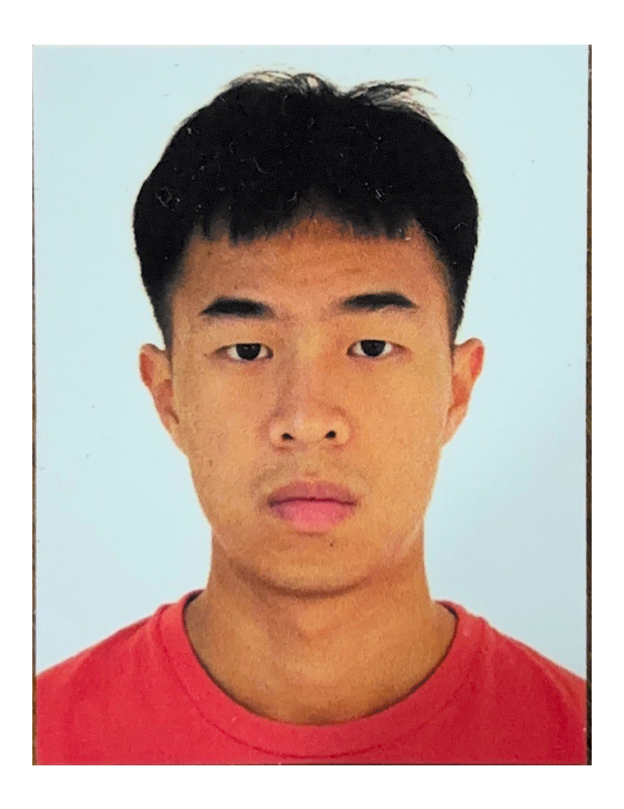

# About Us

We are a team based in the [School of Computing, National University of Singapore](http://www.comp.nus.edu.sg).

You can reach us at the email `seer[at]comp.nus.edu.sg`

## Project team

### Quek Syn Hui

[[github](https://github.com/synh)]

* Role: Developer

### Zhuo Xuan

[[github](https://github.com/zx-2003)]

* Role: Team Member

### Jane Doe

[[github](http://github.com/johndoe)]
[[portfolio](team/johndoe.md)]

* Role: Team Lead
* Responsibilities: UI

### Linq Herng

[[github](http://github.com/LinqWithQ)]

* Osu! player
* Scuba diver
* Role: IDK
* Responsibilities: NOTHING

### Jean Doe

[[github](http://github.com/johndoe)]
[[portfolio](team/johndoe.md)]

* Role: Developer
* Responsibilities: Dev Ops + Threading

### Brendan Chong

[[github](http://github.com/brendaan07)]

* Role: Developer
* Responsibilities: UI

