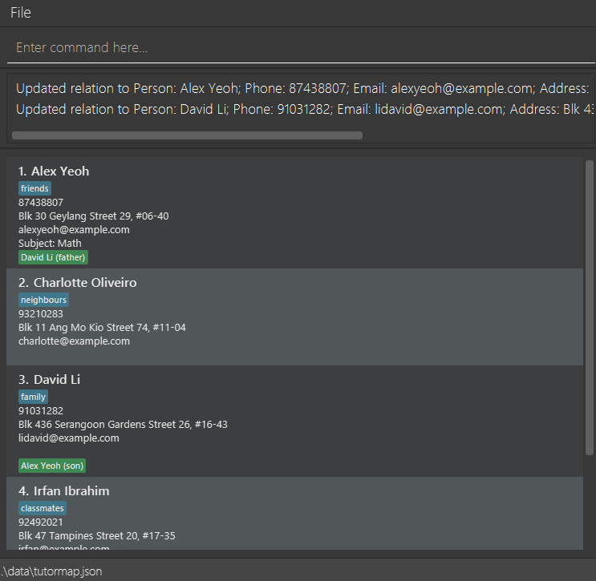

# User Guide

TutorMap is a **desktop app for private tutors to manage tutees, optimized for use via a Command Line Interface** (CLI) while still retaining mouse-based visual elements. TutorMap helps you manage tutee details in one place, including addresses, phone numbers, subjects taught, and relationships between contacts (eg. students, parents and agents).

TutorMap offers you a simple way to stay organized without complex software. If you have basic computer skills, and have been tracking tutees in spreadsheets or notes, then TutorMap is for you. It replaces messy spreadsheets so you can focus on teaching, not admin.

## Table of Contents

- [Quick start](#quick-start)
- [Features](#features)
  - [Viewing help : `help`](#viewing-help)
  - [Adding a person: `add`](#adding-person)
  - [Listing all persons : `list`](#listing-persons)
  - [Editing a person : `edit`](#editing-person)
  - [Adding or deleting a relation : `relate`](#relating-persons)
  - [Finding persons: `find`](#finding-persons)
  - [Renaming, deleting or editing subject(s): `subject`](#subject-command)
  - [Deleting a person : `delete`](#deleting-person)
  - [Clearing all entries : `clear`](#clearing-entries)
  - [Exiting the program : `exit`](#exiting-program)
- [Saving the data](#saving-the-data)
- [Editing the data file](#editing-the-data-file)
- [FAQ](#faq)
- [Known issues](#known-issues)
- [Command summary](#command-summary)

--------------------------------------------------------------------------------------------------------------------

## Quick start

1. Ensure you have Java `17` or above installed in your Computer. 
   **Mac users:** Ensure you have the precise JDK version prescribed [here](https://se-education.org/guides/tutorials/javaInstallationMac.html).

2. Download the latest `.jar` file from [here](https://github.com/AY2526S2-CS2103T-W12-3/tp/releases).

3. Copy the file to the folder you want to use as the _home folder_ for your TutorMap.

4. Open a command terminal, `cd` into the folder you put the jar file in, and use the `java -jar tutormap.jar` command to run the application. 
   A GUI similar to the below should appear in a few seconds. Note how the app contains some sample data. 
   

5. Type the command in the command box and press Enter to execute it. e.g. typing **`help`** and pressing Enter will open the help window. 
   Some example commands you can try:

    * `list` : Lists all contacts.

    * `add n/John Doe p/98765432 e/johnd@example.com a/John street, block 123, #01-01` : Adds a contact named `John Doe` to the TutorMap.

    * `delete 3` : Deletes the 3rd contact shown in the current list.

    * `clear confirm` : Deletes all contacts.

    * `exit` : Exits the app.

6. Refer to the [Features](#features) below for details of each command.

--------------------------------------------------------------------------------------------------------------------

## Features

**Notes about the command format:** 

* Words in `UPPER_CASE` are the parameters to be supplied by the user. 
  e.g. in `add n/NAME`, `NAME` is a parameter which can be used as `add n/John Doe`.

* Items in square brackets are optional. 
  e.g. `n/NAME [t/TAG]` can be used as `n/John Doe t/friend` or as `n/John Doe`.

* Items with `...` after them can be used multiple times including zero times. 
  e.g. `[t/TAG]...` can be used as ` ` (i.e. 0 times), `t/friend`, `t/friend t/family` etc.

* Parameters can be in any order. 
  e.g. if the command specifies `n/NAME p/PHONE_NUMBER`, `p/PHONE_NUMBER n/NAME` is also acceptable.

* Extraneous parameters for commands that do not take in parameters (such as `help`, `list` and `exit`) will be ignored. 
  e.g. if the command specifies `help 123`, it will be interpreted as `help`.

* Commands cannot exceed 400 characters in length.

* If you are using a PDF version of this document, be careful when copying and pasting commands that span multiple lines as space characters surrounding line-breaks may be omitted when copied over to the application.
  </box>

### Viewing help : `help`

Provides a message to the user displaying the list of different commands.

Command format: `help`

### Adding a person: `add`

Adds a person to TutorMap.

Command format: `add n/NAME p/PHONE_NUMBER e/EMAIL a/ADDRESS [s/SUBJECT]... [t/TAG]...`

Notes:
* A person can have any number of subjects (including 0)
* A person can have any number of tags (including 0)
* Person fields are case-sensitive (e.g. `John Doe` and `john doe` are different names, `Math` and `math` are different subjects)
* Phone numbers should contain only digits and be at least 3 digits long, optionally prefixed with a parenthesized country code. Examples: `(+65)12389123`, `12398123`, `(1809)12312093`, `(23-39)1289312`

* Examples:
* `add n/John Doe p/98765432 e/johnd@example.com a/John street, block 123, #01-01`
* `add n/Betsy Crowe t/friend e/betsycrowe@example.com a/Newgate Prison p/1234567 t/criminal`
* `add n/Ceaser Chips t/student e/cc@example.com a/Mary street p/1234567 s/Math`

### Listing all persons : `list`

Shows a list of all persons in TutorMap.

Command format: `list`

### Editing a person : `edit`

Edits an existing person in TutorMap.

Command format: `edit INDEX [n/NAME] [p/PHONE] [e/EMAIL] [a/ADDRESS] [s/SUBJECT]... [t/TAG]...`

Notes:
* Edits the person at the specified `INDEX`. The index refers to the index number shown in the displayed person list. The index **must be a positive integer** 1, 2, 3, ...
* Existing values will be updated to the input values.
* When editing subjects, the existing subject of the person will be removed i.e. adding of subject is not cumulative.
* When editing tags, the existing tags of the person will be removed i.e. adding of tags is not cumulative.
* You can remove the person's subject by typing `s/` without specifying any subject after it.
* You can remove all the person’s tags by typing `t/` without specifying any tags after it.
* Typing `s/` or `t/` is only valid if there is at least one non-whitespace character after it. Inputs containing only spaces after `t/` or `s/` are invalid.
* Phone numbers should contain only digits and be at least 3 digits long, optionally prefixed with a parenthesized country code. Examples: `(+65)12389123`, `12398123`, `(1809)12312093`, `(23-39)1289312`
Examples:
* `edit 1 p/91234567 e/johndoe@example.com` Edits the phone number and email address of the 1st person to be `91234567` and `johndoe@example.com` respectively.
* `edit 2 n/Betsy Crower t/` Edits the name of the 2nd person to be `Betsy Crower` and clears all existing tags.
* `edit 3 s/` Clears existing subject for the 3rd person.
* `edit 3 s/Math` Edits the subject of the 3rd person to be `Math`.
* `edit 4 s/English s/Science` Edits the subjects of the 4th person to be `English` and `Science`.

<box type="tip" seamless>

**Tip:**
Use the edit command to add tags or subjects to an existing person by including the existing tags or subjects in the edit command. 
e.g. if the person at index 1 has an existing tag `friend`, `edit 1 t/friend t/colleague` will add the tag `colleague` while keeping the existing tag `friend`.

</box>

### Adding or deleting a relation : `relate`

Adds a relation between 2 specified people in TutorMap.

Command format: `relate [a\RELATION]... [d\RELATION]...`

`RELATION` format: `PERSON1/PERSON2/RELATION_NAME1/RELATION_NAME2`

Notes:
* For `relate` command, at least one argument of `[a\RELATION]` or `[d\RELATION]` is required.
* For any relation:
  *  both person must exist.
  * `PERSON1` and `PERSON2` must be different.
  * There is no restriction for relation name (except `\` is not allowed).
* For adding relation, the relation to be added must not exist before adding.
* For deleting relation, the relation to be deleted must exist before deleting.
* For adding or deleting of relation, the change of relation field will be updated for both persons.
* Upon adding, `PERSON1` and how `PERSON2` is related to them will be shown on `PERSON1`'s contact, and vice versa for `PERSON2`.
* `RELATION_NAME1` refers to how `PERSON1` is related to `PERSON2`. e.g. `Teacher Alex/Bernice Yu/Teacher/Student` means that `Teacher Alex` is `Bernice Yu`'s `Teacher`
* `RELATION_NAME2` refers to how `PERSON2` is related to `PERSON1`.  e.g. `Teacher Alex/Bernice Yu/Teacher/Student` means that `Bernice Yu` is `Teacher Alex`'s `Student`
* Relations are bidirectional, `Teacher Alex/Bernice Yu/Teacher/Student` is equivalent to `Bernice Yu/Teacher Alex/Student/Teacher`.
* The command is case-sensitive for `PERSON` e.g. `David` will not match `david`
* The command is case-sensitive for `RELATION_NAME` e.g. `Student` will not match `student`
* Supports multiple addition and/or deletion operations in the same command e.g. `relate a\RELATION1 d\RELATION2 ...`, `relate a\RELATION1 a\RELATION2 ...`

Examples:
* `relate a\Teacher Alex/Bernice Yu/Teacher/Student` will create a relation for both `Teacher Alex` and `Bernice Yu`.
* `relate d\Teacher Alex/Bernice Yu/Teacher/Student` will delete the relation for both `Teacher Alex` and `Bernice Yu`
* `relate a\Bernice Yu/Alex Yeoh/parent/child d\David Li/Charlotte Oliveiro/brother1/brother2` will add a relation for `Bernice Yu` and `Alex Yeoh` and delete the relation for `David Li` and `Charlotte Oliveiro`

### Finding persons: `find`

Finds and displays anyone who has the KEYWORD contained in their field specified by the prefix.

Command format: `find prefix/KEYWORD`

- Valid prefixes: `n`, `p`, `a`, `s`, `t`, `r`
  - `n`: Search by name
  - `p`: Search by phone number
  - `a`: Search by address
  - `s`: Search by subject
  - `t`: Search by tag
  - `r`: Search by relation

Notes:
* All searches are case-insensitive. e.g. `hans` will match `Hans`
* Partial searching is supported. However, it is advised to be as specific as possible. While the app supports a command that looks like `find r/ce/bo`, resulting in relations between `Alice` and `Bob` to appear, the freedom may seem unintuitive.
* As relations are bidirectional, `find r/Bernice Yu/Alex Yeoh` is equivalent to `find r/Alex Yeoh/Bernice Yu`
* Find by name, subject and tag supports multiple inputs. `find n/Sally David` will display anyone who has *either* `Sally` or `David` in their name, and similarly for subjects and tags.

Examples:
* `find n/John` will find everyone with `john` in their name
* `find n/John Bill` will find everyone with `john` OR `bill` in their name 
* `find t/online` will find everyone labelled with a tag that is or contains `online`
* `find t/online offline` will find everyone labelled with a tag that is or contains `online` OR `offline`
* `find r/mother` will find everyone who is a mother, or has a mother
* `find r/brother/sister` will find all brothers who have sister(s), and sisters who have brother(s)
* `find r/Alex Yeoh` will find everyone related to Alex Yeoh and himself
* `find r/Alex Yeoh/Bernice Yu` will display both people to see the relations between them
* `find s/Math` will find everyone labelled with the subject that is or contains `Math`
* `find s/Math Science` will find everyone labelled with the subject that is or contains `Math` OR `Science`
* `find e/gmail` will find everyone whose email contains `gmail`
* `find a/Blk` will find everyone whose address contains `Blk`
* `find p/8` will find everyone whose phone number contains `8`

### Renaming, deleting, or editing subject(s): `subject`

Renames a subject name across all currently listed persons, deletes subject(s) across all currently listed persons, or edits one person's subject field.

Command format: 
* `subject r\SUBJECT1/SUBJECT2`
* `subject d\SUBJECT1[/SUBJECT2/SUBJECT3/...]`  
* `subject INDEX e\SUBJECT1[/SUBJECT2/SUBJECT3/...]`

Notes:
* All `SUBJECT` values must be alphanumeric (without whitespaces) only and non-empty.
* For renaming a subject:
    * `r\SUBJECT1/SUBJECT2` renames every instance of `SUBJECT1` to `SUBJECT2` across all currently listed persons' subject fields.
    * Renaming a non-existing `SUBJECT` is not allowed.
* For deleting subject(s):
    * `d\SUBJECT1/SUBJECT2/SUBJECT3` deletes every instance of `SUBJECT1`, `SUBJECT2`, and `SUBJECT3` across all persons' subject fields.
    * `d\` accepts any positive number of subjects. 
    * Deleting a non-existing `SUBJECT` is not allowed.
* For editing a person's subject field:
    * `INDEX e\SUBJECT1/SUBJECT2/...` edits the `INDEX`-th shown person's subject field by toggling each listed subject. This command provides functionality for adding and removing subjects in a single command.
    * `INDEX` must be a positive integer.
    * Toggling means:
        * an existing subject is removed; and
        * a non-existing subject is added.
    * `e\` accepts any positive number of subjects.

Examples:
* `subject r\Maths/Mathematics`
* `subject d\Mathematics/Mandarin`
* `subject d\Biology/Physics/Chemistry/History/Art`
* `subject 1 e\Maths/Biology`
* `subject 2 e\Physics/Chemistry/History/Art`

### Deleting a person : `delete`

Deletes the specified person from TutorMap.

Command format: `delete INDEX`

Notes: 
* Deletes the person at the specified `INDEX`.
* The index refers to the index number shown in the displayed person list.
* The index **must be a positive integer** 1, 2, 3, ...

Examples:
* `list` followed by `delete 2` deletes the 2nd person in the tutor map.
* `find Betsy` followed by `delete 1` deletes the 1st person in the results of the `find` command.

### Clearing all entries : `clear`

Clears all entries from the tutor map. As a safety measure, `clear` returns the command usage information, and does not actually clear the output.

Command format: `clear confirm`

**Caution**: This action is irreversible! Use `clear confirm` to clear. Any parameters other than `confirm` will abort the clearing.

### Exiting the program : `exit`

Exits the program.

Command format: `exit`

### Saving the data

TutorMap data are saved in the hard disk automatically after any command that changes the data. There is no need to save manually.

### Editing the data file

TutorMap data are saved automatically as a JSON file `[JAR file location]/data/tutormap.json`. Advanced users are welcome to update data directly by editing that data file.

**Caution:**
If your changes to the data file makes its format invalid, TutorMap will discard all data and start with an empty data file at the next run.  Hence, it is recommended to take a backup of the file before editing it. 
Furthermore, certain edits can cause the TutorMap to behave in unexpected ways (e.g., if a value entered is outside the acceptable range). Therefore, edit the data file only if you are confident that you can update it correctly.
</box>

--------------------------------------------------------------------------------------------------------------------

## FAQ

**Q**: How do I transfer my data to another Computer? 
**A**: Install the app in the other computer and overwrite the empty data file it creates with the file that contains the data of your previous TutorMap home folder.

--------------------------------------------------------------------------------------------------------------------

## Known issues

1. **When using multiple screens**, if you move the application to a secondary screen, and later switch to using only the primary screen, the GUI will open off-screen. The remedy is to delete the `preferences.json` file created by the application before running the application again.

--------------------------------------------------------------------------------------------------------------------

## Command summary

Action     | Format, Examples
-----------|----------------------------------------------------------------------------------------------------------------------------------------------------------------------
**Add**    | `add n/NAME p/PHONE_NUMBER e/EMAIL a/ADDRESS [s/SUBJECT]... [t/TAG]...`   e.g., `add n/James Ho p/22224444 e/jamesho@example.com a/123, Clementi Rd, 1234665 t/relative's child s/math`
**Clear**  | `clear confirm`
**Delete** | `delete INDEX`  e.g., `delete 3`
**Edit**   | `edit INDEX [n/NAME] [p/PHONE] [e/EMAIL] [a/ADDRESS] [s/SUBJECT]... [t/TAG]...`  e.g.,`edit 2 n/James Lee e/jameslee@example.com`
**Find** | `find n/NAME [MORE_NAMES]` e.g., `find n/James Jake`   `find r/RELATION` e.g., `find r/mother`, `find r/Alex Yeoh/Bernice Yu`   `find a/ADDRESS` e.g., `find a/Blk`, `find a/kent ridge`   `find e/EMAIL` e.g., `find e/john@fakemail.com`, `find e/gmail`   `find p/PHONE` e.g., `find p/999`, `find p/8`   `find s/SUBJECT [MORE_SUBJECTS]` e.g., `find s/math english`   `find t/TAG [MORE_TAGS]` e.g., `find t/paid online`
**List**   | `list`
**Help**   | `help`
**Relate** | `relate [a\RELATION]... [d\RELATION]...`  e.g., `relate a\Bernice Yu/Alex Yeoh/parent/child d\David Li/Charlotte Oliveiro/brother1/brother2`
**Subject** (rename)|`subject [r\SUBJECT1/SUBJECT2]`  e.g., `subject r\Math/Mathematics`
**Subject** (delete)|`subject [d\SUBJECT1/SUBJECT2/SUBJECT3/...]`  e.g., `subject d\Art/History/Mandarin/English`
**Subject** (edit)|`subject INDEX [e\SUBJECT1/SUBJECT2/SUBJECT3/...]`  e.g., `subject 1 e\Art/History/Mandarin/English`

